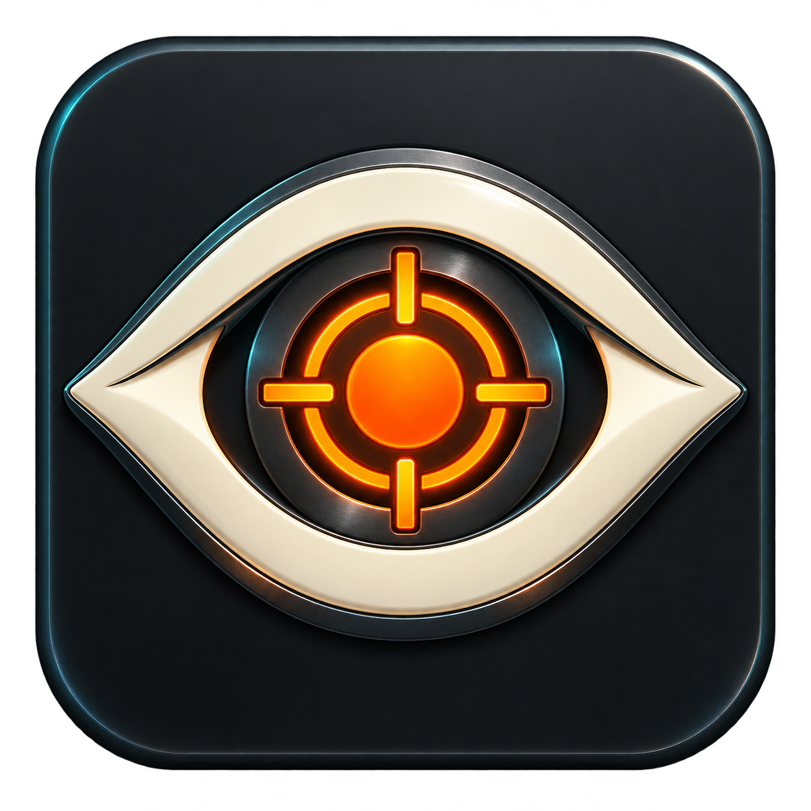

# Deadeye Arcade



**Your lightguns. Your games. One Windows arcade.**

Turn your Windows PC into a fullscreen lightgun game room. Browse covers and video
previews, set up your guns, let Deadeye handle supported game profiles and common
setup problems, and return to the library with your gun.

[](LICENSE)
[](https://github.com/sthamann/deadeye-arcade/releases/latest)
[](#language)

**[Download the latest Windows installer](https://github.com/sthamann/deadeye-arcade/releases/latest)** · [Portable downloads and checksums](https://github.com/sthamann/deadeye-arcade/releases)

## See it in action


**[Download the full-resolution UI video](docs/images/deadeye-library.mp4)**

*Captured from the running frontend with a curated selection of game artwork and
preview clips. The video plays inside the app; these are UI recordings, not mockups.
Original game-media files are not bundled as library assets.*


*Blue Estate screenshot reference: [official Steam store](https://store.steampowered.com/app/305380/Blue_Estate_The_Game/). Game artwork belongs to its respective owners.*


*Gun Studio is shown in browser preview without simulating connected hardware.*

## Your game room

- **A library made for the big screen:** search, favorites, platform filters and a
  featured game with a launch button. Aim at the fixed **Up / Down** buttons and
  pull the trigger to scroll. Selecting a cover returns to the featured game.
- **Artwork and previews:** local covers, muted game-video previews, screenshots
  and logos. Download missing covers with an optional SteamGridDB API key or
  choose your own artwork.
- **Useful game details:** English descriptions, release years and original
  hardware when available, plus controls, setup requirements and separate launch
  and gameplay status. Imports preserve existing enriched information.
- **Your existing games:** import TeknoParrot profiles, scan available MAME ROMs
  against the installed emulator's catalog, add Windows game applications or
  import a collection JSON. Existing favorites and media are retained.
- **An arcade look throughout:** an original app icon for Windows, Setup and
  shortcuts, with a matching dark desktop wallpaper. [Artwork and wallpaper](docs/branding.md).

## Set up your lightguns

**My Guns** brings device detection, player assignment, physical controls and setup
checks into one place. The header shows P1/P2, the detected model and its software
setup status. Supported hardware families are **RS3 Reaper Pro, Sinden,
X-Gunner Wireless and Blamcon Vyper**.

Each family has its own illustrated controls. Press a button to see its live
highlight, capture the signal from your device and bind it to a menu or game action.
Physical control capture and action bindings are stored separately, so the diagram
can show what you pressed even when you change what the button does.
[Physical controls and hardware references](docs/HARDWARE-CONTROLS.md).

For **RS3 Reaper Pro**, Deadeye provides USB/COM detection, automatic player
assignment, mouse mode, aspect-ratio and offscreen-reload settings, plus bounded
recoil and rumble test pulses. Prepare the checked manufacturer calibration module,
then run a fullscreen four-target calibration for the selected player and a
separate five-target aim test at the physical monitor.

For the other families, Deadeye provides product or receiver detection, input
assignment and access to the supported manufacturer setup software. A wireless
receiver alone does not establish the number of active guns; live input and
model-specific calibration remain part of setup.

RS3 recoil and grip rumble are separate mechanisms. Hardware switches and the
specified power supply determine the mechanical recoil; there is no documented
continuous force slider. Installed helpers such as DemulShooter and Hook of the
Reaper can run with a game session, with matching per-game setup for game-driven
feedback. [Calibration and compatibility](docs/compatibility.md).

## Automatic setup and repairs

Deadeye carries **17 reviewed rules** for common setup pitfalls. It checks the
library at startup and after import, then rechecks the selected game before launch.
Supported input profiles are prepared from the assigned guns as part of the actual
launch path.

| What Deadeye recognizes | What it does |
| --- | --- |
| Moved TeknoParrot game files | Repairs an unambiguous existing game path and preserves the original profile. |
| Broken portable emulator paths | Repairs supported Model 2 search paths, inaccessible PCSX2 memory-card storage and matching TeknoParrot metadata. |
| Missing OpenAL or Hypseus support files | Downloads exact reviewed official packages, checks hashes and compatibility, and restores eligible absent files with their licenses. |
| P1/P2 input assignments | Prepares supported MAME, TeknoParrot, DemulShooter, RetroArch, Flycast, Supermodel, RPCS3 and Dolphin input paths. |
| Supported Dolphin games | Matches the actual disc region to a reviewed accuracy profile, preserves learned offsets and prepares separate RS3 DSU channels for supported two-gun setups. Dead Space Extraction uses Hybrid Ubershaders. |
| Recognized installed multiplayer extensions | Configures matching Blue Estate and HOTD 2: Remake inputs using each extension's actual device format. |
| Supported game-specific profiles | Applies known Aliens and Model 2 presentation settings, reads the reviewed Time Crisis 5 controls helper and prepares specific installed arcade-loader libraries. |
| Required Windows runtimes | Inspects launch programs and local libraries; offers matching Visual C++, DirectX and .NET components from Microsoft with architecture and signature checks. |
| Missing files or access requirements | Identifies the affected game and remaining step, including vendor access, Windows elevation and shared PCSX2 pointers. |

Open **Settings → Automatic repairs** to inspect results, next steps, known pitfalls
and recent changes, or select **Check and repair library**. Repairs and launch-time
profile changes are recorded locally; changed profile files include before/after
hashes. Repeated checks leave healthy files unchanged. New reviewed rules arrive
through normal app updates. [Automatic repair guide](docs/automatic-repairs.md).

Manufacturer logins, Windows consent, installer license prompts and physical
calibration can require your interaction. Game files and matching multiplayer
patches must be supplied separately; Deadeye configures recognized installed
integrations rather than treating every patch as compatible.

## Play with your gun

When the game window becomes visible, a **ten-second controls introduction** shows
your gun and the actions from the active profile. The game keeps input focus and
the introduction disappears automatically. The controls reference reads supported
emulator and helper profiles for each player; unresolved inputs stay visible.
Windowed and borderless presentation supports desktop overlays; exclusive
fullscreen can cover them.

| Action | Gun or keyboard control |
| --- | --- |
| Browse the library | Aim and trigger; stick navigation and fixed scrolling buttons are also available. |
| Return from a game | Hold **Start + Coin** on the assigned gun for about **two seconds**. Keyboard: **F12**. |
| Open the in-game menu | Hold the assigned trigger for **at least ten seconds**, then release. Keyboard: **F10**. Autofire can interrupt this hold; Start + Coin is the primary emergency gesture. |
| Resume, restart or end a game | Select the corresponding in-game menu action, or use D-pad navigation and Start to confirm. |
| Close Deadeye and return to Windows | Select the persistent **Close app · Windows** button. After returning from a game, release Start/Coin and hold them again in the frontend to close it. |

Game sessions reserve a single launch and supervise their own process tree to
prevent duplicate starts and clean up owned games and helpers on exit. Emergency
exit detection runs independently of the frontend UI thread. The native close
button remains available during dialogs, button testing and background checks.
The in-game menu does not automatically pause the game; timers and audio may continue.
[In-game menu details](docs/in-game-overlay.md).

Optional **blue P1/P2 desktop crosshairs** follow assigned absolute-input guns over
Windows Desktop and Explorer. They pass clicks through, hide over games and other
applications, and can remain active with the frontend closed. Windows still has
one shared system click pointer.

## Emulator support

| System | Current integration | Game-specific setup to check |
| --- | --- | --- |
| TeknoParrot | Profile import, path repair, supported RawInput gun bindings, controls reference and supervised launch | Vendor access, required elevation, special pedals/actions and matching helper/output configuration |
| MAME | Import from the emulator's lightgun catalog and present ROM archives, generated controller mapping and controls reference | Game overrides, service calibration and ROM compatibility |
| Dolphin / Wii | Region-matched accuracy profiles, RS3 controls and separate native DSU inputs for supported two-gun profiles | Supported disc ID, physical aiming and each game's actions; other regions retain existing settings |
| RetroArch | Explicit player-device assignments and supported core profiles | Core-specific controls and overrides |
| Flycast | Per-device RawInput mapping for supported launch paths | Correct content, emulator build and game calibration |
| Supermodel | Live RawInput mouse/keyboard assignment, including supported title overrides | Service calibration and actual simultaneous gameplay |
| Standalone RPCS3 | Raw Mouse / PS Move configuration on recent compatible builds | Per-player game calibration; bundled TeknoParrot RPCS3 is a separate path |
| Model 2 | ROM search paths, supported presentation and installed DemulShooter setup | Matching helper target and service calibration |
| PCSX2 | Portable storage repair, launch paths and detection of shared GunCon2 pointers | A shared Windows pointer does not provide independent two-gun play |
| Other Windows games and emulators | Manual or collection-import launch paths, configured helpers and runtime inspection | Build-specific plugins, input adapters and per-title requirements |

Automatic import and input configuration differ by system. **Early access:**
software setup and launch checks are separate from verified aiming, independent
P2 inputs and recoil. Deadeye keeps these statuses distinct; a successful launch
is not a full playthrough. [Game-specific compatibility guide](docs/compatibility.md).

## Get started on Windows

1. Download **Deadeye Arcade Setup** and run it. It installs for your Windows user
   and adds desktop and Start menu shortcuts. The .NET runtime is included; Setup
   installs Microsoft Edge WebView2 Runtime if needed, using an Internet connection.
2. Connect your guns and open **My Guns**. Inspect player assignment, prepare the
   supported software and check the live physical buttons.
3. Calibrate at the physical monitor. For RS3, run the integrated four-target
   calibration followed by the separate aim test.
4. Use **Find Games** to import supported profiles, scan MAME games or add an
   existing Windows application or collection JSON.
5. Review **Settings → Automatic repairs**, then launch a game. Check aiming,
   actions and both players before confirming gameplay in Game Details.
6. Hold **Start + Coin** to return to the library, or use the in-game menu.

Fullscreen is on by default. **Start with Windows is off by default** and can be
changed in Settings. Desktop crosshairs have a separate background startup entry,
enabled by default and controlled by their own toggle.

Games, ROMs, emulators and manufacturer utilities are not bundled. Setup and the
portable package are not code-signed. Uninstall removes app files and shortcuts
while retaining your library, settings and media.

### Language

**English is the default.** Select **Settings → Language → English / Deutsch** to
change the frontend, native menu, dialogs and app messages. The choice survives
restart and updates. Game titles, user notes, paths and external manufacturer or
emulator interfaces retain their original language.
[Localization details](docs/localization.md).

## Updates, local data and diagnostics

Deadeye checks stable GitHub releases at startup and every six hours. Open
**Settings → App updates → Install update and restart** when an update is available.
The installer download is checked against GitHub's SHA-256 digest and expected size.
Deadeye backs up the library, updates in place and reopens with your games, gun
mappings, language and startup preferences preserved. Updates cannot be installed
while a game is running. Automatic checks can be disabled; manual checks remain
available. [Installer and updater details](docs/updates.md).

The library, settings and repair reports live under `%LOCALAPPDATA%\ReaperArcade`.
The optional SteamGridDB API key uses Windows user-bound encryption. Diagnostic
export includes device assignments, game status, repair findings and recent changes,
with API keys excluded. Repair and update checks do not upload your library or gun
data. The executable and storage names remain `ReaperArcade` for compatibility.

Display diagnostics record current and saved Windows modes and distinguish Remote
Desktop from local sessions. With desktop crosshairs enabled, the companion also
records mode transitions while the frontend is closed. An RDP refresh rate does
not establish the physical TV's refresh rate, and calibration requires the physical
screen.

With the frontend closed, these commands operate on the current Windows user's library:

```powershell
ReaperArcade.exe --import-collection "C:\path\to\spiele.json"
ReaperArcade.exe --repair-library
ReaperArcade.exe --inspect-display
ReaperArcade.exe --validate-library
ReaperArcade.exe --check-dependencies
ReaperArcade.exe --inspect-guns
```

Runtime inspection covers known executable imports and .NET configurations.
Dynamically loaded plugins, drivers and special library search paths can require
additional setup. Unknown DLLs are never downloaded from DLL portals.

## Build and contribute

Requirements: **Node.js** and **.NET SDK 10**.

```sh
cd ui
npm ci
npm run build
cd ..
dotnet run --project src/Reaper.Checks -c Release
dotnet publish src/Reaper.Windows -c Release -r win-x64 --self-contained true -o release/windows-x64
```

Keep the complete publish output, including `web/`. The installer build also needs
NSIS (`makensis.exe`) and Internet access for the Microsoft bootstrapper. On Windows,
[`scripts/build-windows.ps1`](scripts/build-windows.ps1) builds and packages the portable app.
The application is native WPF with a locally packaged React/WebView2 interface;
it does not require a local web server in normal Windows use.

For the browser preview and its checks:

```sh
cd ui
npx playwright install chromium
npm run dev -- --port 5199
# In a second terminal, from the repository root:
node scripts/check-ui.cjs
```

The preview demonstrates the interface without performing hardware or file operations.
UI and native code share [`localization/en.json`](localization/en.json). German source
messages are the keys; English translations are the values. Keep numbered placeholders
and surrounding spaces intact. [Localization details](docs/localization.md).

Further reading: [architecture](docs/architecture.md), [Gun Studio](docs/gun-studio.md),
[automatic repairs](docs/automatic-repairs.md), [compatibility](docs/compatibility.md)
and [third-party components](THIRD-PARTY.md). Some detailed implementation notes
are in German.

## License

Deadeye Arcade's application code is licensed under the **[MIT License](LICENSE)**.
Third-party runtimes and components retain their own terms; see
[THIRD-PARTY.md](THIRD-PARTY.md) and the packaged `licenses/` folder.
