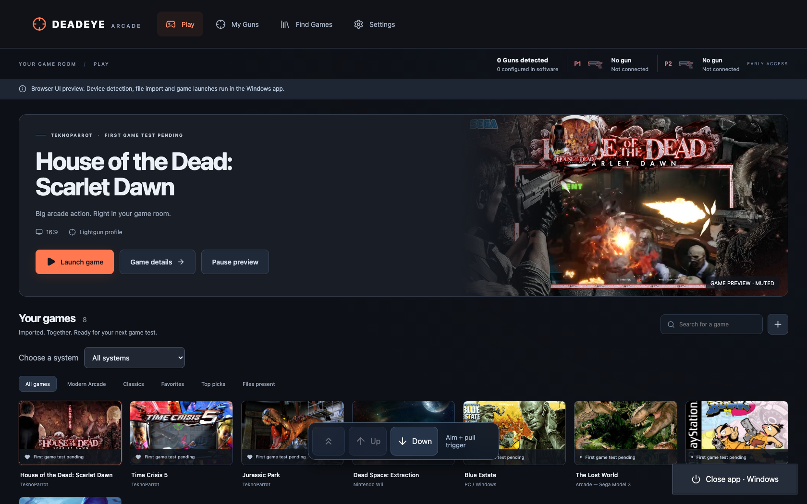
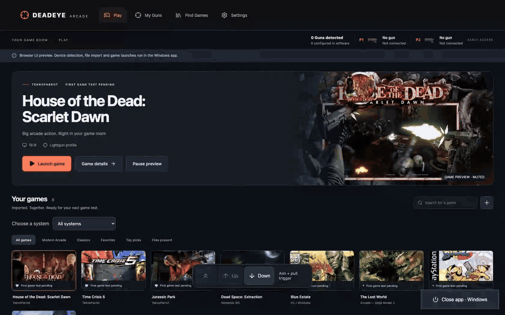
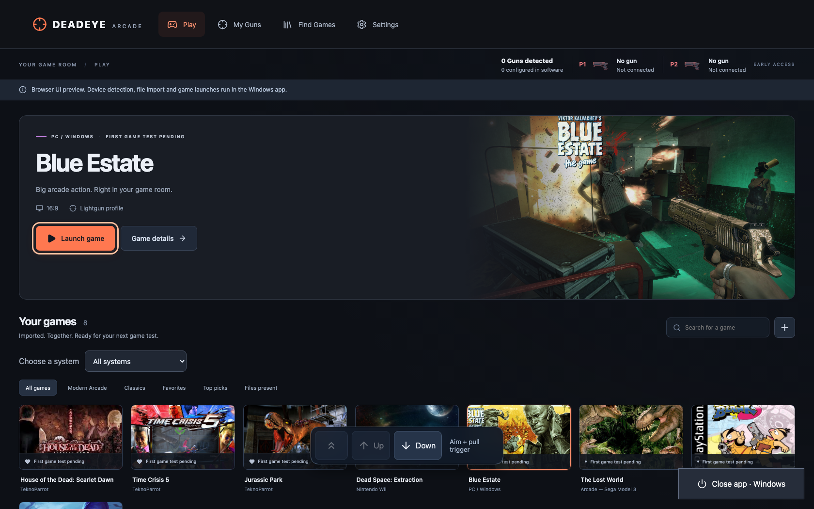
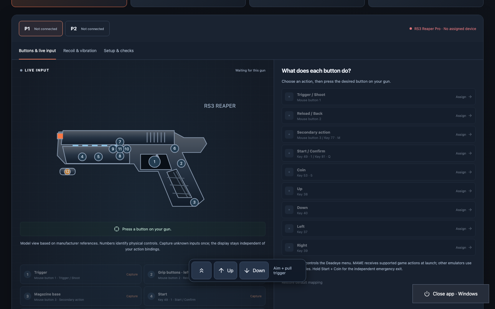
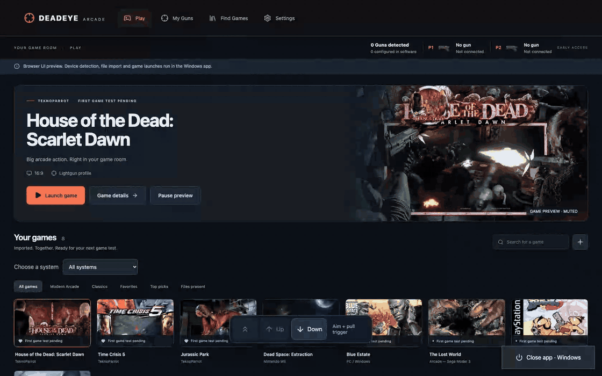

# Deadeye Arcade

**Your lightguns. Your games. One Windows arcade.**

A fullscreen, gun-first launcher for your existing lightgun collection. Browse games,
set up player inputs, check required runtimes, and return from a game without
reaching for a keyboard.

[](LICENSE)
[](https://github.com/sthamann/deadeye-arcade/releases)
[](#language)

**[Download Windows Setup 0.3.10](https://github.com/sthamann/deadeye-arcade/releases/download/v0.3.10/Deadeye-Arcade-0.3.10-Setup-x64.exe)** · [Release notes & checksums](https://github.com/sthamann/deadeye-arcade/releases/tag/v0.3.10)

> **Early access.** The Windows frontend and game-session flows have been tested.
> A connected RS3 has been detected and configured in software. Physical aiming,
> the ten-second trigger gesture and game-driven recoil still require local
> hardware tests. Deadeye does not mark a game as playable just because its files exist.

Use the fixed **Up / Down** buttons to scroll by aiming and pulling the trigger. Selecting a cover returns to the featured game's launch button. Gun Studio now shows model-specific physical controls, with independent live highlights and input capture. [Hardware references and exact control behavior](docs/HARDWARE-CONTROLS.md).

## See it in action





**[Download the full-resolution UI video](docs/images/deadeye-library.mp4)**

*Captured from the running frontend with a curated selection of game artwork and
preview clips. The video plays inside the app; these are UI recordings, not mockups.
Original game-media files are not bundled as library assets.*



*Blue Estate screenshot reference: [official Steam store](https://store.steampowered.com/app/305380/Blue_Estate_The_Game/). Game artwork belongs to its respective owners.*





*Gun Studio is shown in browser preview without simulating connected hardware.*

## What's inside

**0.3.10** improves the in-game escape menu across RS3 mouse and joystick modes.
Connected trigger holds survive unrelated device changes, and a desktop mouse fallback
covers games that capture mouse input. Dead Space: Extraction receives a per-game
latency preset with explicit absolute pointing and lower graphics overhead.
[Verification notes](docs/verification-0.3.10.md) separate software checks, Windows
launch checks and physical gun validation.

- **Multiplayer helper setup:** writes the actual connected gun IDs before launching installed DemulShooter helpers. Unassigned channels cannot pick up nameless Remote Desktop mice. Blue Estate uses distinct VID/PID assignments for an already installed, matching patch; HOTD 2 Remake has its own plugin requirements.
- **Classic .NET dependencies:** detect CLR 2 executables, including launch helpers, and offer the matching Microsoft Windows feature or installer. CLR 4 startup overrides are respected.
- **Game information:** short English descriptions, release years, original hardware, and explicit demo or unreleased-prototype labels. Enrichment checks exact game identity and all replacement files before saving; imports retain enriched information.
- **A fullscreen game library:** search, favorites, platform filters, game details,
  local covers, muted preview videos, screenshots and logos.
- **Lightgun Studio:** RS3 Reaper Pro, Sinden, X-Gunner Wireless and Blamcon Vyper
  system selection; grouped USB devices, P1/P2 status, live button diagrams and
  learnable menu bindings.
- **An in-game menu:** hold the assigned trigger for **at least 10 seconds**, release
  it, then shoot **Resume game**, **Restart game** or **End game**. D-pad navigation
  and Start confirmation are available too.
- **A controls reference:** P1/P2 mappings read from MAME, TeknoParrot, Dolphin/Wii
  and RetroArch configuration files. Unknown mappings and possible game overrides
  are identified rather than guessed.
- **RS3 screen calibration:** prepare the manufacturer module automatically and
  calibrate a selected player in a fullscreen four-target sequence. Remote Desktop
  allows preparation; calibration needs the physical screen and gun.
- **Game-specific setup:** reviewed USA Dolphin accuracy profiles with RS3 P1
  controls and live per-player Supermodel RawInput routing. Game Details explains
  remaining P2, plugin and patch requirements. [Compatibility guide](docs/compatibility.md).
- **Runtime checks:** inspect launch programs and local DLLs on startup, after
  import and before launch. Missing supported Visual C++, DirectX and .NET runtimes
  can be downloaded from Microsoft with architecture and signature checks.
- **A dependable way out:** a native **Close app · Windows** button stays outside
  the scrolling web interface. Hold Start + Coin for about two seconds to end a
  game; release both, then hold again in the frontend to close the app. **F10** opens
  the game menu; **F12** ends the current game session.
- **English and German:** English by default; change the language in Settings.
  The choice applies to the frontend, native menu, dialogs and app messages, and
  survives restart.
- **Local storage:** a backed-up JSON library, user-bound encryption for the optional
  SteamGridDB key, and diagnostic export without API keys.

The in-game menu does **not automatically pause the game**. Background game timers,
inputs or audio may continue while the menu is open.

## Get started on Windows

1. Download and run **Deadeye Arcade Setup** above. It installs for your Windows user
   without administrator rights and adds desktop and Start menu shortcuts.
2. Open Deadeye Arcade. The .NET runtime is included; Setup installs Microsoft
   Edge WebView2 Runtime if it is missing (an Internet connection is then required).
3. Open **My Guns**. Connect your gun, inspect P1/P2 detection, and prepare its
   software. An RS3's COM player ID is used for automatic assignment.
4. For RS3, prepare and run the integrated four-target **screen calibration** at the
   physical monitor, then check live buttons and run the separate five-target aim test.
   [Calibration and game-specific setup](docs/compatibility.md) explains the distinction.
5. Open **Find Games** to import existing TeknoParrot profiles, scan MAME ROMs against
   that emulator's catalog, add a Windows game application, or import a collection handoff.
6. Launch a game, test aiming and buttons, then use the game menu to return.
   Confirm playability in Game Details only after a real test.

Fullscreen is enabled by default. **Start with Windows is off by default** and can
be enabled separately in Settings. The installer and portable package are not code-signed.
Games, ROMs, emulators and manufacturer utilities are **not included**.

### Language

Open **Settings → Language → English / Deutsch**. Existing libraries without a
language preference also start in English. Changing language preserves games,
favorites, gun bindings and the Windows autostart setting.

The browser preview remembers its own language in local storage; the Windows app
stores the choice in `%LOCALAPPDATA%\ReaperArcade\library.json`. Imported game titles,
user notes, file paths and external manufacturer/emulator interfaces keep their
original language.

## Install and update

**Upgrading from Reaper Arcade 0.3.4 or earlier:** install the new Deadeye Setup
once. The repository rename changes the download address, which older versions
reject by design. Your library and settings are retained; subsequent versions use
the new update endpoint. The executable and existing data/registry IDs remain
`ReaperArcade` for upgrade compatibility.

Setup registers Deadeye Arcade in Windows Installed Apps. Uninstall removes app files
and shortcuts while keeping your library, settings and media. The optional portable
ZIP remains available under [Releases](https://github.com/sthamann/deadeye-arcade/releases).

The app checks **stable GitHub releases** at startup and every six hours. When a newer
installer is available, it shows an update notice. Open **Settings → App updates →
Install update and restart**. The download is checked against GitHub's SHA-256 digest
and expected size before the installer starts. Deadeye closes, updates in place and
reopens. A library backup is saved before installation; gun mappings, language and
autostart preferences are preserved. Updates cannot be installed during a game.
Failed or interrupted downloads leave the running app intact. Automatic checks can
be disabled; **Check for updates** remains available. Prereleases and older versions
are excluded from automatic updates. The update request sends no library or gun data.

New version tags run [the Windows release workflow](.github/workflows/windows-release.yml):
UI build, core checks, native publish, Microsoft bootstrapper signature check, installer,
portable ZIP and SHA-256 checksums are generated and uploaded to GitHub Releases.
[Installer and updater details](docs/updates.md).

## Support at a glance

| System | Available today | Still needs verification / configuration |
| --- | --- | --- |
| RS3 Reaper Pro | USB/COM detection, automatic player assignment, mouse mode, aspect ratio, offscreen reload, bounded recoil/rumble test pulses | Physical aiming, feedback feel and title-specific game outputs |
| Sinden | Product detection, input assignment and preparation of checked manufacturer software | Local calibration, manufacturer prompts and game profiles |
| X-Gunner Wireless | Receiver/product detection, input assignment and checked configuration software | A receiver alone does not prove how many wireless guns are active; actual input is required |
| Blamcon Vyper | Product-family detection, input assignment and Blamcon ARC entry through Steam | Exact model confirmation, calibration and physical feedback |
| TeknoParrot | Import UserProfiles, repair unambiguous game paths, configure connected guns for supported RawInput controls, launch and read mappings | Pedals, unusual title-specific actions and helper/output setup |
| MAME | Import actual lightgun catalog + present ROM archives, generated controller mapping, controls reference | Game overrides, calibration and real gameplay |
| Dolphin / RetroArch | Launch paths from collection handoffs; read supported control configuration | Dedicated automatic import adapters and title/core-specific overrides |
| Other systems | Executable discovery for several emulators/tools; manual or handoff launch paths | Dedicated import/input adapters and per-title tests |

RS3 recoil and grip rumble are separate mechanisms. Deadeye can send test pulses;
there is **no documented continuous RS3 force slider**. Hardware switches and the
specified power supply determine mechanical recoil. Helpers such as DemulShooter
and Hook of the Reaper can be launched with a session, but still need appropriate
per-game configuration for real output-driven feedback.

## Bring an existing collection

In **Find Games → Import collection handoff**, select `spiele.json`. Existing
favorites, covers and gun bindings are retained. **Validate library** checks launch
files and TeknoParrot GamePath independently of gameplay confirmation.

With the app closed, these commands use the intended Windows game user's library:

```powershell
ReaperArcade.exe --import-collection "C:\path\to\spiele.json"
ReaperArcade.exe --validate-library
ReaperArcade.exe --check-dependencies
ReaperArcade.exe --inspect-guns
```

Reports are stored under `%LOCALAPPDATA%\ReaperArcade`. Runtime inspection covers
known PE imports and .NET runtime configurations; dynamically loaded plugins,
special DLL search paths, drivers, older .NET Framework requirements and vendor
packages may need additional setup. Unknown DLLs are never downloaded from DLL portals.

## Verification

[0.3.5 branding, media and upgrade checks](docs/verification-0.3.5.md).

- **106 core checks:** imports, file readiness, preservation after reload, player
  isolation, trigger hold timing, control-profile parsing, dependency detection,
  English defaults, native translations, saved language preference and update validation.
- **Browser checks:** English ↔ German switching and reload, four pages at five
  screen widths, library search/filters, raw-input routing, live button state,
  player-isolated aim tests, picker and on-screen keyboard.
- **Windows language checks:** English default with an existing library, immediate
  switching, cold restart in both languages, localized native exit button and
  CarnEvil/MAME in-game menu. Library entries and saved gun bindings remained intact;
  autostart stayed off. [language verification](docs/verification-0.3.2.md).
- **Installer and self-update:** the GitHub Windows workflow built and published
  0.3.3. A controlled older Windows build downloaded that public release through
  the app, installed it and restarted as 0.3.3; library entries and gun mappings
  were preserved. [Installer/update verification](docs/verification-0.3.3.md).
- **Windows game-session checks:** rendered title/menu screens in MAME, Dolphin,
  RetroArch, TeknoParrot, Supermodel and Blue Estate, and the GunCon2 calibration screen in PCSX2.
  Resume/restart/exit checks and unresolved emulator cases are recorded in
  [0.3.4 verification](docs/verification-0.3.4.md).
- **Physical gun validation remains pending:** USB/COM detection is distinct from
  button, aim, calibration and recoil verification. Not every imported title has
  been launched or tested.

Imported entries and file availability do not establish playability. Test each
title with its configured emulator and gun before confirming it as playable.

## Build and contribute

Requirements: **Node.js** and **.NET SDK 10**.

```sh
cd ui
npm ci
npm run build
cd ..
dotnet run --project src/Reaper.Checks -c Release
dotnet publish src/Reaper.Windows -c Release -r win-x64 --self-contained true -o release/windows-x64
```

Keep the complete publish output, including `web/`. The installer build also needs
NSIS (`makensis.exe`) and Internet access for the Microsoft bootstrapper. On Windows,
[`scripts/build-windows.ps1`](scripts/build-windows.ps1) builds and packages the portable app.
The application is native WPF with a locally packaged React/WebView2 interface;
it does not require a local web server in normal Windows use.

For the browser preview and its checks:

```sh
cd ui
npx playwright install chromium
npm run dev -- --port 5199
# In a second terminal, from the repository root:
node scripts/check-ui.cjs
```

The preview demonstrates the interface without performing hardware or file operations.
UI and native code share [`localization/en.json`](localization/en.json). German source
messages are the keys; English translations are the values. Keep numbered placeholders
and surrounding spaces intact. [Localization details](docs/localization.md).

Further implementation notes: [architecture](docs/architecture.md),
[Gun Studio](docs/gun-studio.md), [in-game menu](docs/in-game-overlay.md),
[Windows checks](docs/verification-0.3.md). These earlier detailed notes are currently in German.

## License

Deadeye Arcade's application code is licensed under the **[MIT License](LICENSE)**.
Third-party runtimes and components retain their own terms; see
[THIRD-PARTY.md](THIRD-PARTY.md) and the packaged `licenses/` folder.
