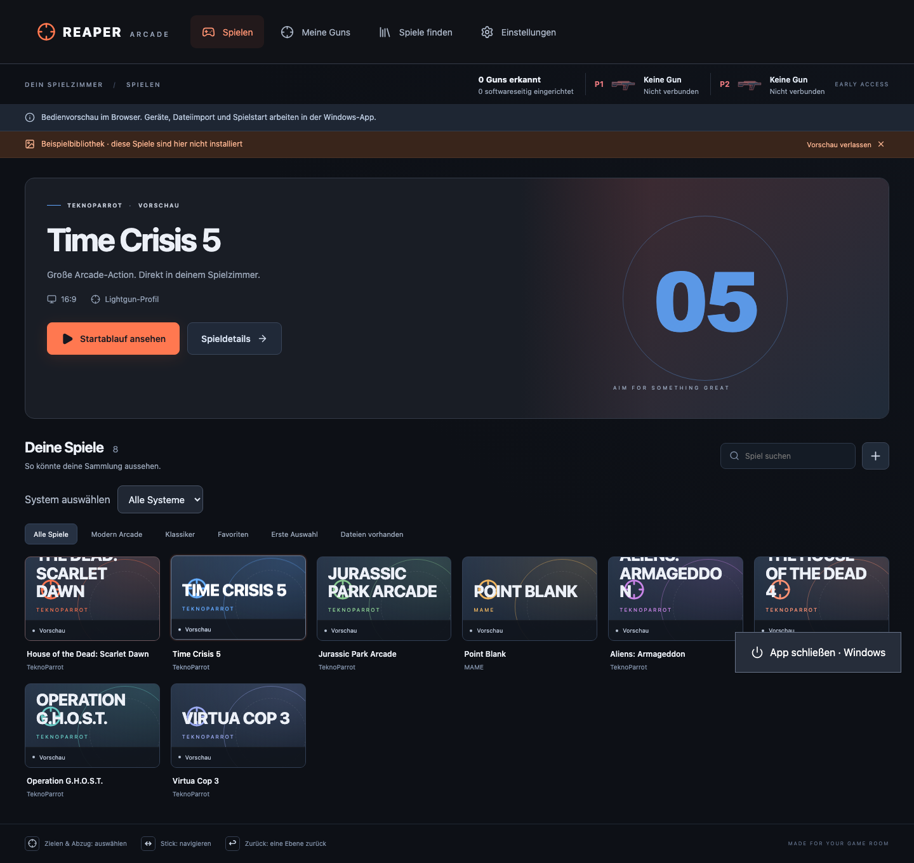

# Reaper Arcade 0.3 – in Entwicklung

Eine Windows-App für RS3 Reaper Pro und eine gemeinsame Lightgun-Bibliothek: große Vollbildoberfläche, getrennte Gun-Eingänge und Import vorhandener TeknoParrot-/MAME-Spiele.

**[Windows-Version 0.3.0 herunterladen](https://github.com/sthamann/reaper-arcade/releases/download/v0.3.0/Reaper-Arcade-0.3.0-Windows-x64.zip)** · [Entwicklungsrelease und Quellcodepaket](https://github.com/sthamann/reaper-arcade/releases/tag/v0.3.0)



Die Abbildung zeigt die optionale Beispielbibliothek mit eigenen Cover-Platzhaltern. Die echte Bibliothek startet leer. Spiele, ROMs, Emulatoren und Herstellerwerkzeuge werden nicht mitgeliefert.

**Früher Entwicklungsstand:** Die Windows-Oberfläche und der Programmstart wurden getestet. Eine RS3 ist inzwischen per USB und COM-ID nachgewiesen. Reale Tastendrücke, Zielgenauigkeit und vollständige Spielekompatibilität sind noch nicht abschließend geprüft.

## Lightgun Studio in 0.3

- Auswahl für RS3 Reaper Pro, Sinden, X-Gunner Wireless und Blamcon Vyper.
- Physische USB-Geräte gruppieren, automatische RS3-Spielerzuordnung per COM-ID und zusätzliche Windows-Schnittstellenabfrage für Remote-Sitzungen.
- P1/P2-Silhouetten und Status im Header; Live-Tasten in einer schematischen Gun-Zeichnung und lernbare Menübelegung. Die unterstützten MAME-Spielaktionen werden beim Start exportiert.
- RS3-Format, Offscreen-Reload und begrenzte Feedbacktests; tatsächliche Kraftschalter verständlich erklärt.
- Offizielle Herstellerprogramme vorbereiten: Sinden/X-Gunner per geprüftem Download, Blamcon ARC über Steam. Kalibrierung und nicht implementierte Hersteller-/Emulatoradapter bleiben ausdrücklich offen.

Details, unterstützte Pfade und Grenzen: [Gun Studio](docs/gun-studio.md).

## Erweiterungen in 0.3

- Import der `spiele.json`-Übergabe mit alternativen Startwegen, Abhängigkeiten, Prioritäten und Spielerangaben. Fehlende Dateien sperren den Start; eine erneute Prüfung kann abgeschlossene Kopien freigeben.
- Vorschauvideos ohne Ton mit Pause beim Ansichtswechsel, Dialog und Spielstart; Screenshots und Logos. Medienzugriff bleibt auf eigene Medienordner begrenzt.
- Große Systemauswahl sowie Filter für erste Priorität und vorhandene Startdateien.
- Einzeltests für Rückstoß, Rumble und die Kombination am lokalen Bildschirm; keine stufenlose Kraftsteuerung.
- Explizit konfigurierte Helfer starten mit der Spielsitzung und werden vor der Menürückkehr beendet. Dies allein ersetzt keine Konfiguration ihrer Spieloutputs.
- Automatische Prüfung der EXE- und DLL-Abhängigkeiten beim Öffnen, nach Importen und vor dem Spielstart. Fehlende Visual-C++-2010/2012/2013/14-, DirectX-Zusatz- und .NET-8/9/10-Laufzeiten lassen sich über offizielle Microsoft-Installer ergänzen; Architektur, Download-Adresse und Microsoft-Signatur werden geprüft. Lizenz und Windows-Freigabe bleiben im Herstellerdialog.
- Ein großer nativer Knopf „App schließen · Windows“ bleibt außerhalb der scrollenden Browseroberfläche sichtbar, auch bei Dateiauswahl und laufender Suche. Start + Münze etwa zwei Sekunden halten beendet im Spiel die Sitzung und im Menü die App; vor dem zweiten Ausstieg beide Tasten loslassen.
- F12 beendet die eigene Spielsitzung zusätzlich zur Gun-Kombination, auch per Remote Desktop. Die Tastenerkennung dafür ist ausschließlich während einer eigenen Spielsitzung aktiv.

Version 0.3 wurde auf dem Lightgun-PC installiert: 183 Titel importiert und 639 Medien kopiert. Echte Vorschauvideos laufen in WebView2. Dead Space Extraction startet über Dolphin bis zum Titelbildschirm und CarnEvil über MAME bis zur echten Arcade-Bootsequenz und Blue Estate bis ins Hauptmenü; F12 beendet die eigene Spielsitzung und bringt das Vollbildmenü zurück. Die Spielekopie und weitere Emulatorprüfungen laufen noch. Eine RS3 ist inzwischen angeschlossen und antwortet mit Spieler-ID 1. Der Download oben enthält diesen Entwicklungsstand; Details stehen in [verification-0.3.md](docs/verification-0.3.md).

## Direkt auf dem Windows-PC starten

1. Das Paket **Reaper-Arcade-0.3.0-Windows-x64.zip** auf den Windows-PC kopieren und vollständig entpacken.
2. **ReaperArcade.exe** öffnen. Eine separate .NET-Installation ist nicht nötig.
3. Unter **Meine Guns** das Lightgun Studio öffnen. Eine erkannte RS3 wird über ihre COM-Spieler-ID automatisch P1 oder P2 zugeordnet und für Maus-/Tastatureingaben eingerichtet. Weitere Systeme auswählen und deren Herstellerprogramm vorbereiten lassen. Tasten mit dem Live-Test prüfen und bei Bedarf durch Anklicken einer Aktion neu belegen.
4. Den Zieltest durchführen. Er prüft fünf Ziele; er schreibt keine Kalibrierung in die Firmware.
5. Unter **Spiele finden** TeknoParrot, MAME oder eine Windows-Spielanwendung auswählen.
6. Das erste Spiel starten, Zielen und Tasten im Spiel prüfen und anschließend Start + Münze etwa zwei Sekunden halten. Auf Spieler 1 entspricht das `1` + `5`, auf Spieler 2 `2` + `6`.
7. Unter **Einstellungen** bei Bedarf Vollbild und Start nach Windows-Anmeldung aktivieren.

Vorausgesetzt werden Windows x64 und die Microsoft Edge WebView2 Runtime. Falls die Runtime fehlt, erklärt die App das beim Start. Download: https://developer.microsoft.com/microsoft-edge/webview2/ . Das Paket ist ein noch nicht signierter Entwicklungsstand.

## Was in 0.2 implementiert ist

- Native WPF-Anwendung mit lokal verpackter React-Oberfläche. Kein Webserver oder Browserfenster für den Windows-Betrieb nötig.
- Cinema-Layout mit horizontalem Hauptmenü, großem Spielbereich und Coverkarten; Vollbild, Favoriten, Suche, Plattformfilter und Spieldetails.
- Automatische Suche in üblichen Installationsordnern nach TeknoParrot, MAME und weiteren Emulatoren/Tools. Eine gefundene Anwendung ist noch kein funktionierendes Spieleprofil.
- Große Datei- und Ordnerauswahl direkt im Vollbild sowie Bildschirmtastatur für Suche und Cover-Schlüssel.
- Bibliotheksprüfung auf fehlende Startdateien. Fehlende Dateien setzen alte Spielbestätigungen zurück.
- Remote-Desktop-Modus für die Bedienprüfung; Gun-Zuordnung und Kalibrierung am echten Bildschirm prüfen.
- Auswahl und Start eines vorhandenen Hersteller-Kalibrierwerkzeugs mit anschließender Rückkehr ins Menü.
- Enumeration der Windows-Raw-Input-Geräte; Erkennung der Retro-Shooter-Familie, wenn das Gerät einen passenden Produktnamen liefert. Modell und Firmware werden nicht geraten.
- Bewusste Zuordnung des Maus- und Tasteneingangs pro Spieler; kein automatisches Zusammenwerfen der Geräte.
- Getrennte absolute Zielkoordinaten und Abzugseingaben; Navigation mit Stick im Maus-/Tastaturmodus.
- Geführter Zieltest: nur die dem gewählten Spieler zugeordnete Gun wird im nativen Betrieb gewertet. Der Test zeigt Trefferabweichung und Fehlschüsse; er misst keine Latenz.
- Optionaler COM-Port pro Gun. Vor jeder Steuerung wird `ID` abgefragt und mit dem Spieler verglichen. Mausmodus und 4:3/16:9 werden in einem begrenzten Befehlsablauf angefordert; anschließend endet der externe Steuerungsmodus.
- TeknoParrot-Import bereits angelegter `UserProfiles` mit kuratierter Zuordnung bekannter Lightgun-Titel. Nicht zugeordnete Profile werden im Importbericht genannt. Ein vorhandenes Basisprofil und eine vorhandene Spielanwendung sind Voraussetzung.
- MAME-Import anhand des tatsächlichen `-listxml`-Katalogs dieses Emulators und vorhandener ZIP-/7z-ROMs. Beim Start entsteht eine eigene Controller-Datei mit den gespeicherten Gun-IDs. Vorhandene MAME-Konfigurationen werden nicht überschrieben.
- Manuelles Hinzufügen von Windows-Spielanwendungen.
- Lokale Cover sowie SteamGridDB-Abruf bei genau einer passenden Titelzuordnung. Mit gespeichertem Schlüssel folgt der Coverabruf auch nach dem Import. Der Schlüssel wird mit Windows DPAPI benutzergebunden verschlüsselt.
- Lokale Bibliothek in `%LOCALAPPDATA%\ReaperArcade`, Sicherung der vorigen JSON-Version, Wiederherstellung nach Neustart und Diagnoseexport ohne API-Schlüssel.
- Spielstart mit gespeicherten Argumenten, Beobachtung des gestarteten Prozesses und seiner Folgestarts, Rückkehr ins Menü nach Ende, gezieltes Beenden der eigenen Spielsitzung.

## Was noch folgt

- Automatische Konfiguration der TeknoParrot-Controller: 0.2 startet das bereits vorhandene Profil. Dessen Eingabebelegung muss zunächst im Emulator stimmen.
- Automatische Geräte- und Firmwareprüfung des Hersteller-Kalibrierwerkzeugs. In 0.2 lässt sich dessen vorhandene EXE auswählen und lokal starten; der eigene Zieltest schreibt keine Firmwarekalibrierung.
- DemulShooter und Hook of the Reaper für titelabhängige Mehrspieler- und Spielefeedback-Profile. 0.2 verändert deren Konfiguration noch nicht und erzeugt keine spieleabhängigen Recoil-/LED-Ausgaben.
- Spieleimport und Eingabeadapter für DuckStation, PCSX2, Dolphin, Flycast, Model 2 und Supermodel sowie automatischer Steam-Import. Die Installationssuche erkennt die üblichen EXE-Namen bereits; vollständige Unterstützung folgt pro Adapter.
- Signierter Installer und Updates.

Spielauswahl, Dateiimport und seltene Texteingaben besitzen große Bedienelemente für die Gun. Der optionale Diagnoseexport verwendet noch einen Windows-Speicherdialog. Ein externes Herstellerwerkzeug behält seine eigene Bedienoberfläche.

## Frühere Verifikation von 0.2

Version 0.2 wurde am 3. Oktober 2026 auf einem Windows-Test-PC per Remote Desktop installiert und gestartet. WPF/WebView2, Cinema-Vollbild, Wechsel der Ansichten, Installationssuche, Dateiauswahl und Bildschirmtastatur liefen dort. Desktop- und Startmenü-Verknüpfung sind vorhanden. Der optionale Windows-Autostart wurde aktiviert und nach erneutem App-Start sowohl in der Bibliothek als auch im Benutzer-Run-Eintrag nachgewiesen. Anschließend wurde er in den Einstellungen wieder ausgeschaltet; ein Windows-Neustart wurde nicht durchgeführt. Bei einer neuen Bibliothek ist Autostart standardmäßig aus.

Ein temporäres Profil startete `cmd.exe /c "timeout /t 10"` durch die echte Spielsitzung. Das externe Programm war sichtbar; nach dessen Ende kehrte das Vollbildmenü automatisch zurück. Der Testeintrag wurde danach entfernt. Das ist ein Prozess- und Rückkehrtest, kein erfolgreich gespielter Lightgun-Titel.

26 Kernprüfungen und die Browserprüfung bestanden. Die üblichen Installationsordner lieferten auf diesem PC keine unterstützte Emulatorinstallation. Individuelle Ordner können anschließend im Vollbild ausgewählt werden.

**Die RS3-Guns waren dort nicht angeschlossen.** Echte USB-/COM-Eingaben, Kalibrierung, Spielertrennung und reale TeknoParrot-/MAME-Spiele bleiben deshalb offen. Die Bibliothek startet leer und vergibt keine erfundenen Spielbarkeitsurteile. „Von dir bestätigt“ setzt der Nutzer nach einem tatsächlichen Spieltest.

## Weiterentwickeln

Node.js und .NET SDK 10 werden zum Bauen benötigt:

```text
cd ui
npm ci
npm run build
cd ..
dotnet run --project src/Reaper.Checks -c Release
dotnet publish src/Reaper.Windows -c Release -r win-x64 --self-contained true -o release/windows-x64
```

Die portable Windows-App benötigt den vollständigen Inhalt von `release/windows-x64` einschließlich `web/`. `scripts/build-windows.ps1` baut und verpackt diesen Stand auf Windows. `npm run dev` im Ordner `ui` öffnet eine reine Bedienvorschau, ohne Hardware- oder Dateioperationen zu simulieren.

Für die Browserprüfung einmal `npx playwright install chromium` im Ordner `ui` ausführen. Danach dort die Vorschau mit `npm run dev -- --port 5199` starten und aus dem Projektordner `node scripts/check-ui.cjs` aufrufen. Alternativ setzt `REAPER_PREVIEW_URL` die Adresse der laufenden Vorschau.

Technische Entscheidungen und Herstellerreferenzen: [docs/architecture.md](docs/architecture.md). Erster echter Test: [docs/windows-test.md](docs/windows-test.md).

## Lizenz

Der Quellcode ist öffentlich einsehbar; eine offene Lizenz für den eigenen Anwendungscode wurde noch nicht festgelegt. Siehe [LICENSE](LICENSE). Die Lizenzbedingungen der Abhängigkeiten sind unter [THIRD-PARTY.md](THIRD-PARTY.md) aufgeführt.

## Vorhandene Sammlung einrichten

Unter **Spiele finden → Übergabepaket importieren** die `spiele.json` auswählen. Bereits gespeicherte Favoriten, Covers und Gun-Bindings bleiben erhalten. **Bibliothek prüfen** kontrolliert Abhängigkeiten und TeknoParrot-GamePath; der Spieltest bleibt davon getrennt. Medien aus dem Übergabeplan liegen unter `C:\Lightgun\Media` und werden ohne zusätzliche Kopie in den Benutzerordner bereitgestellt.

`scripts/install-collection.ps1 -Package <Windows-ZIP> -Handoff <Übergabeordner> -StartAfter` sichert eine vorhandene Installation/Bibliothek, verlangt abgeschlossene Migrationsjournale, kopiert Medien, importiert die Bibliothek und legt Verknüpfungen an. Mit `-AllowPendingMigration` können Frontend und Medien bereits während der Spielekopie eingerichtet werden; der Bericht kennzeichnet den offenen Migrationsstand. Danach **Bibliothek prüfen** erneut ausführen. Das Skript startet keine konkurrierenden Migrationsjobs und schaltet Autostart nicht ein. Fehlende Quellen bleiben im Bericht unter `C:\Lightgun\Setup\Logs`.

Einrichten ohne Oberfläche: `ReaperArcade.exe --import-collection <spiele.json>` beziehungsweise `--validate-library`, jeweils bei geschlossener App und unter dem vorgesehenen Windows-Spielbenutzer. Die Ergebnisse stehen in `%LOCALAPPDATA%\ReaperArcade\library-import-report.json`.

## Fehlende Laufzeiten automatisch prüfen

Unter **Einstellungen → Spiele und Emulatoren: benötigte Laufzeiten** zeigt die App fehlende Pakete und betroffene Spiele. **Fehlende Pakete installieren** lädt die passenden offiziellen Microsoft-Installer und prüft ihre Authenticode-Signatur. Reaper minimiert sich für den Installer und prüft nach dessen Ende erneut. Lizenz, Windows-Freigabe und ein gegebenenfalls angebotener Neustart erfolgen im Microsoft-Dialog. Ein durch bekannte fehlende Pflichtbibliotheken blockierter Spielstart führt direkt zu dieser Ansicht.

Die Prüfung liest Windows-Programmdateien, lokale DLLs und vorhandene `.runtimeconfig.json`-Dateien. Sie unterscheidet x86 und x64 sowie zwingende und verzögert geladene Bibliotheken. Dynamisch nachgeladene Plugins, besondere DLL-Suchpfade, Treiber, ältere .NET-Framework-/Side-by-Side-Abhängigkeiten und herstellereigene Pakete werden damit nicht vollständig erfasst. Unaufgelöste Dateien bleiben sichtbar; unbekannte DLLs werden nicht von Downloadportalen nachgeladen. **Dateien vorhanden** bestätigt weder passende API-Versionen noch einen erfolgreichen Spielstart.

Bei geschlossener App: `ReaperArcade.exe --check-dependencies`. Der Bericht wird unter `%LOCALAPPDATA%\ReaperArcade\dependencies.json` gespeichert.
